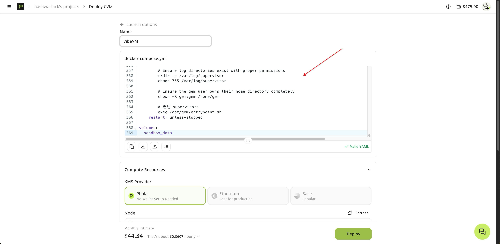

# VibeVM 🚀

> Your complete AI agent development environment running in a Trusted Execution Environment (TEE). Browser automation, code execution, and cryptographic capabilities - all in one secure sandbox.

## Why VibeVM?

Stop juggling multiple tools and environments. VibeVM gives you everything you need to build AI agents:

- **🌐 Browser Control** - Full Chrome browser with VNC, Playwright, and automation tools
- **💻 VSCode Server** - Complete IDE in your browser, no local setup needed
- **📦 Pre-installed Tools** - Python 3.13, Node.js 22, git, gh CLI, and 20+ developer tools via Flox
- **🔒 TEE Security** - Cryptographic key derivation and remote attestation via Dstack
- **📁 Unified Workspace** - All tools share the same filesystem - no more file shuffling
- **📱 Mobile Access** - Code on the go with Happy CLI mobile connection

**Perfect for:** Web scraping agents, blockchain applications, confidential computing, secure API integrations, and any AI agent that needs both automation and cryptographic guarantees.

## Files in This Repository

### docker-compose.yaml
The complete deployment configuration for VibeVM. Copy this entire file and paste it into your Phala Cloud dashboard when deploying.


**Features:**
- ✅ Auto-installation of Flox package manager with 20+ dev tools (configurable)
- ✅ Happy CLI installation for mobile remote connection (configurable)
- ✅ Claude Code AI assistant installation (configurable)
- ✅ GitHub repository auto-cloning on startup
- ✅ TEE socket mounting for cryptographic operations
- ✅ Docker socket access for container management
- ✅ Complete environment setup (Python, Node.js, git, gh CLI)
- ✅ Automatic user creation with sudo privileges
- ✅ Persistent workspace volume

[📄 View docker-compose.yaml](docker-compose.yaml)

### .env.example (for local testing)
Template for environment variables when testing locally:

```bash
# GitHub Integration
GITHUB_REPO=your-username/your-repo
GH_TOKEN=ghp_your_github_token_here

# Phala Cloud API
PHALA_API_KEY=your_phala_api_key

# Optional: Customize display
DISPLAY_WIDTH=1920
DISPLAY_HEIGHT=1080
TZ=America/New_York
```

Copy `.env.example` to `.env` for local Docker testing, but **set these as secrets in Phala Cloud dashboard** for production deployments.

---

## Quick Reference

### Default Configuration
```bash
# User context
USER=gem
HOME=/home/gem
WORKSPACE=/workspace
```

### Key Locations
```bash
/home/gem/                    # Your home directory (persisted)
/home/gem/your-repo-name/     # Auto-cloned GitHub repo
/home/gem/.flox-env/          # Flox environment with all tools
/var/run/dstack.sock          # TEE API socket
/var/run/docker.sock          # Docker daemon socket
/workspace/                   # Persistent volume
```

### Port Mapping
```bash
8080  # Main UI (VNC, VSCode, API docs, dashboard)
8089  # MCP Server
8079  # Additional services
8000  # Additional services  
8091  # Additional services
```

### Essential Commands
```bash
# Activate Flox environment (auto-activated)
flox activate -d /home/gem/.flox-env

# GitHub authentication
gh auth login

# Install additional tools
flox install package-name

# Access TEE info
curl --unix-socket /var/run/dstack.sock http://localhost/info

# View running services
sudo supervisorctl status

# Connect from mobile device
happy
```

---

## Getting Started (5 Minutes)

### Step 1: Sign Up for Phala Cloud

1. Go to [phala.com](https://phala.com) and create an account
2. Navigate to the dashboard and click **"Deploy New CVM"**

### Step 2: Configure Your VibeVM

1. **Copy the `docker-compose.yaml`** from this repo
2. **Paste it into the Phala Cloud dashboard** deployment configuration
3. **Select a Large TDX machine** for optimal performance

> ⚠️ **Cost Management Tip:** VibeVMs are designed for active development sessions. Turn them off when not in use to avoid unnecessary costs. They're powerful machines - don't leave them running 24/7!

### Step 3: Set Your Secrets

Configure these environment variables in the Phala Cloud dashboard:

#### Required Secrets

```bash
# Auto-clone your GitHub repository on startup
GITHUB_REPO=your-username/your-repo

# GitHub Personal Access Token (required for private repos)
GH_TOKEN=ghp_your_github_token_here

# Phala Cloud API Key (for advanced features)
PHALA_API_KEY=your_phala_api_key
```

#### Optional Configuration

```bash
# Control which tools to install (defaults to "true")
INSTALL_FLOX=true        # Flox package manager with dev tools
INSTALL_HAPPY=true       # Happy CLI for mobile remote access
INSTALL_CLAUDE=true      # Claude Code AI assistant

# Set to "false" to skip installation and reduce startup time
```

**Don't have a GitHub token?** Generate one at: https://github.com/settings/tokens/new

**Required Token Permissions (Scopes):**
- ✅ `repo` - Full control of repositories (clone, pull, push)
- ✅ `workflow` - Update GitHub Actions workflows (if using CI/CD)
- ✅ `read:org` - Read org membership (optional, for organization repos)

**For classic tokens:** Select "repo" and "workflow" scopes
**For fine-grained tokens:** Grant "Contents: Read and write" + "Workflows: Read and write" permissions

> 💡 **Pro Tip:** Always set `GITHUB_REPO` if you want your code ready when the VibeVM starts. The repo will be automatically cloned to `/home/gem/your-repo/`

### Step 4: Deploy & Access

1. Click **"Deploy"** in the Phala Cloud dashboard
2. Wait 2-3 minutes for your VibeVM to spin up
3. Go to the **"Network"** tab
4. **Click the URL** that targets **port 8080**

That's it! Your VibeVM is now running. 🎉

---

## First Steps: GitHub Authentication
Open the terminal in VSCode Server or via the web interface and authenticate with GitHub CLI:

```bash
gh auth login
```

Follow the prompts to authorize via your browser. This gives you:
- ✅ Access to private repositories
- ✅ Ability to push commits
- ✅ Full GitHub CLI features

> 💡 **Already have GH_TOKEN set?** GitHub CLI will be automatically configured, but you may still want to run `gh auth login` for interactive features.

### 3. Connect from Mobile (Optional)

VibeVM includes **Happy CLI** for coding on the go from your mobile device:

```bash
# In your VibeVM terminal (VSCode or web terminal)
happy
```

This will:
- Start a remote connection session
- Display a QR code on screen
- Allow you to connect from the Happy Coder mobile app
- Enable real-time coding from your phone/tablet

**Mobile App:** Download "Happy Coder" from your app store to scan the QR code and start coding remotely.

**Use Cases:**
- 🚶 Code while commuting
- 🛋️ Quick fixes from your couch  
- 🌍 Access your VibeVM from anywhere
- 📱 Monitor long-running processes on mobile

> **Note:** Requires Claude CLI to be installed and authenticated. The `happy` command is pre-installed in your VibeVM.

---

## What You Get

Once logged in, access these interfaces from your browser (replace `your-vibevm-url` with your actual URL from Phala Cloud):

### 🌐 VNC Browser
Full Chrome browser for web automation and testing
```
http://your-vibevm-url:8080/vnc/index.html?autoconnect=true
```

### 💻 VSCode Server
Complete development environment in your browser
```
http://your-vibevm-url:8080/code-server/
```

### 📖 API Documentation
Interactive API docs for programmatic control
```
http://your-vibevm-url:8080/v1/docs
```

### 🤖 MCP Services
Model Context Protocol servers for AI agent integration
```
http://your-vibevm-url:8089/
```

### 📱 Mobile Connection
Code on the go with Happy CLI
```bash
# In your VibeVM terminal
happy
# Scan QR code with Happy Coder mobile app
```

---

## Quick Examples

### Python: Browser Automation + TEE

```python
from agent_sandbox import Sandbox
from dstack_sdk import DstackClient

# Initialize clients
sandbox = Sandbox(base_url="http://localhost:8080")
dstack = DstackClient()

# Get TEE instance info
info = dstack.info()
print(f"Running in TEE: App ID {info.app_id}")

# Execute shell command in sandbox
result = sandbox.shell.exec_command(command="ls -la /home/gem")
print(result.data.output)

# Derive a secure key in TEE
key_response = dstack.get_key(path="/my-app/signing-key")
print(f"Secure key derived: {key_response.key[:32]}...")

# Take browser screenshot
screenshot = sandbox.browser.screenshot()
print(f"Screenshot captured: {len(screenshot.data)} bytes")

# Read a file from your workspace
content = sandbox.file.read_file(file="/home/gem/README.md")
print(content.data.content)
```

### JavaScript: Automated Web Scraping with Attestation

```javascript
import { Sandbox } from '@agent-infra/sandbox';
import { DstackClient } from '@phala/dstack-sdk';

const sandbox = new Sandbox({ baseURL: 'http://localhost:8080' });
const dstack = new DstackClient();

// Get TEE attestation before scraping
const info = await dstack.info();
console.log('Scraping with attested TEE:', info.appId);

// Execute scraping script
const result = await sandbox.shell.exec({ 
  command: 'curl -s https://api.example.com/data' 
});
console.log('Data fetched:', result.output);

// Derive signing key to sign the scraped data
const keyResp = await dstack.getKey('/scraper/sign-key');
console.log('Signing key:', keyResp.key);

// Generate quote for data attestation
const quote = await dstack.getQuote('data-hash-here');
console.log('Attestation quote generated');

// Read and process files
const content = await sandbox.file.read({ 
  path: '/home/gem/scraped-data.json' 
});
console.log('Processed data:', content);
```

### cURL: Direct API Access

```bash
# Execute shell command
curl -X POST http://localhost:8080/v1/shell/exec \
  -H "Content-Type: application/json" \
  -d '{"command": "echo Hello from VibeVM && pwd"}'

# Get sandbox environment info
curl http://localhost:8080/v1/sandbox

# Take browser screenshot
curl -X POST http://localhost:8080/v1/browser/screenshot \
  -o screenshot.png

# Read a file
curl -X POST http://localhost:8080/v1/file/read \
  -H "Content-Type: application/json" \
  -d '{"file": "/home/gem/.bashrc"}' | jq .

# Get TEE information
curl --unix-socket /var/run/dstack.sock \
  http://localhost/info | jq .

# Derive a key in TEE
curl --unix-socket /var/run/dstack.sock \
  -X POST http://localhost/prpc/DeriveKey \
  -H "Content-Type: application/json" \
  -d '{"path": "/my-app/key"}' | jq .
```

### Rust: TEE Key Derivation for Blockchain

```rust
use dstack_rust::DstackClient;
use std::error::Error;

#[tokio::main]
async fn main() -> Result<(), Box<dyn Error>> {
    let client = DstackClient::new();
    
    // Get TEE instance information
    let info = client.info().await?;
    println!("App ID: {}", info.app_id);
    println!("Instance ID: {}", info.instance_id);
    
    // Derive a deterministic wallet key
    let wallet_key = client
        .get_key("/wallet/ethereum/0", None)
        .await?;
    println!("Ethereum wallet key: {}", wallet_key.key);
    
    // Generate TDX quote for attestation
    let quote = client
        .get_quote(b"transaction-hash-here")
        .await?;
    println!("TDX Quote generated for attestation");
    println!("Quote: {}...", &quote.quote[..64]);
    
    Ok(())
}
```

---

## docker-compose.yaml

Copy the `docker-compose.yaml` file from this repository and paste it directly into your Phala Cloud dashboard.

**Key configuration to know:**

```yaml
version: '3.8'

services:
  aio-sandbox:
    image: ghcr.io/agent-infra/sandbox:1.0.0.126
    ports:
      - "8079:8079"  # Additional services
      - "8000:8000"  # Additional services
      - "8080:8080"  # Main UI (this is what you'll access)
      - "8089:8089"  # MCP server
      - "8091:8091"  # Additional services
    environment:
      # GitHub integration (set in Phala dashboard)
      - GITHUB_REPO=${GITHUB_REPO}
      - GH_TOKEN=${GH_TOKEN}
      
      # Phala API (set in Phala dashboard)
      - PHALA_API_KEY=${PHALA_API_KEY}
      
      # ... (many more environment variables handled automatically)
    volumes:
      - sandbox_data:/workspace
      - /var/run/dstack.sock:/var/run/dstack.sock  # TEE access
      - /var/run/docker.sock:/var/run/docker.sock  # Docker access
    # ... (automatic setup script included)

volumes:
  sandbox_data:
```

The full `docker-compose.yaml` includes:
- ✅ Automatic user creation and permissions
- ✅ Flox package manager installation (Python 3.13, Node.js 22, git, gh CLI, and 20+ tools)
- ✅ Happy CLI for mobile remote connection (optional via `INSTALL_HAPPY`)
- ✅ Claude Code AI assistant (optional via `INSTALL_CLAUDE`)
- ✅ GitHub repository auto-cloning
- ✅ Secure authentication setup
- ✅ Complete development environment initialization

**Just copy and paste - no modifications needed!** The secrets you set in the dashboard will be automatically injected.

**Customization:** Set `INSTALL_FLOX`, `INSTALL_HAPPY`, or `INSTALL_CLAUDE` to `false` in environment variables to skip installation and reduce startup time.

---

## Pre-installed Tools via Flox

Your VibeVM comes with a complete development environment managed by **Flox** or `apt` (automatically activated on login):

| Category | Tools |
|----------|-------|
| **Languages** | Python 3.13, Node.js 22 |
| **Version Control** | git, GitHub CLI (gh) |
| **Editors** | VSCode Server, Jupyter Notebook, vim, nano |
| **Shell Utilities** | wget, curl, tree, rsync, htop, procps |
| **Text Processing** | grep, sed, awk, jq, ripgrep |
| **Compression** | tar, gzip, unzip |
| **Networking** | netcat, nmap |
| **Media** | imagemagick, yt-dlp |
| **Remote Access** | happy-coder (mobile connection), Claude Code (AI assistant) |

**Flox Environment:** All tools are available immediately upon login. The Flox environment is automatically activated in your shell.

**Note:** Claude Code and Happy CLI are installed via npm if `INSTALL_CLAUDE` and `INSTALL_HAPPY` are set to `true` (default).

### Installing Additional Tools

**With Flox (if `INSTALL_FLOX=true`):**

```bash
# Activate Flox (already done automatically)
flox activate

# Install additional packages
flox install package-name

# Search for packages
flox search package-name
```

**Without Flox (if `INSTALL_FLOX=false`):**

If you disabled Flox installation, use `apt` to install packages:

```bash
# Update package list
sudo apt update

# Install packages
sudo apt install package-name

# Search for packages
apt search package-name
```

> **Note:** The `gem` user has passwordless sudo access for system-level package installation.

---

## TEE Capabilities via Dstack

Access secure TEE operations through `/var/run/dstack.sock`:

### Key Derivation
Generate deterministic cryptographic keys from paths:
```python
key = dstack.get_key(path="/my-app/wallet-key")
```

### Remote Attestation
Prove your code runs in a genuine TEE:
```python
quote = dstack.get_quote(report_data=b"verify-this-data")
# Verify at https://proof.t16z.com/
```

### (Not Recommended for Non-Experts) TLS Certificates
Generate fresh certificates with RA-TLS support:
```python
tls_key = dstack.get_tls_key()
```

---

## Cost Optimization Tips

VibeVMs run on powerful TDX hardware. Keep costs down:

1. **Stop when not developing** - Use the Phala Cloud dashboard to stop your VibeVM when you're done for the day
2. **Use snapshots** - Save your work state and restore it later instead of leaving the VM running
3. **Right-size your machine** - Use Large TDX for development, but consider smaller instances for testing through an interface connecting to the VibeVM API.
4. **Set auto-shutdown** - Configure automatic shutdown after inactivity in the Phala Cloud dashboard

> 💰 **Rule of Thumb:** If you're not actively coding, your VibeVM still pays for compute. You can always shutdown your VibeVM and startup with a clean environment and still retain keys generated with the deterministic key generator.

---

## Common Workflows

### Starting Fresh with Your Project

1. **Set secrets in Phala Cloud:**
   ```bash
   GITHUB_REPO=your-username/your-repo
   GH_TOKEN=ghp_your_token
   ```

2. **Deploy VibeVM** - Your repo auto-clones to `/home/gem/your-repo/`

3. **Access via port 8080** and log in with your credentials

4. **Open VSCode Server** and navigate to your cloned project

5. **Start developing!** All changes are persisted in `/home/gem/`

### Blockchain Agent Development
1. Derive keys in TEE for transaction signing
2. Use browser automation to monitor on-chain events
3. Execute trades/transactions with attested keys
4. Generate quotes to prove execution integrity

```python
from dstack_sdk import DstackClient

# Derive a deterministic wallet key
client = DstackClient()
wallet_key = client.get_key(path="/wallet/main")

# Use for signing transactions
# Keys are derived from the TEE, provably secure
```

### Secure Web Scraping
1. Navigate to target sites with VNC browser
2. Extract data using Playwright automation
3. Process data in Jupyter notebooks
4. Sign results with TEE-derived keys

```python
from agent_sandbox import Sandbox
from dstack_sdk import DstackClient

sandbox = Sandbox(base_url="http://localhost:8080")
dstack = DstackClient()

# Scrape data
screenshot = sandbox.browser.screenshot()

# Derive signing key and attest the data
key = dstack.get_key(path="/scraper/sign-key")
quote = dstack.get_quote(report_data=b"scraped-data-hash")
```

### API Integration Testing
1. Clone your repo on VibeVM startup (auto-configured)
2. Use VSCode Server for development
3. Test APIs with full browser + curl access
4. Generate attestation quotes for API authentication

### Working as User `gem`

VibeVM runs as the `gem` user (not root) for security:

```bash
# Your home directory
cd /home/gem

# Your cloned repo
cd /home/gem/your-repo-name

# Install Python packages (user-level)
pip install --user package-name

# Install npm packages globally (already configured)
npm install -g package-name

# Use sudo for system-level changes (NOPASSWD configured)
sudo apt update
```

### Mobile Development with Happy CLI

Access your VibeVM from your phone or tablet:

1. **Start Happy session in VibeVM:**
   ```bash
   # SSH or open terminal in VSCode Server
   happy
   ```

2. **Scan QR code** with Happy Coder mobile app

3. **Code from mobile:**
   - Run commands remotely
   - Monitor long-running processes
   - Quick bug fixes on the go
   - Check logs and outputs

4. **Real-time sync** between your VibeVM and mobile device

**Perfect for:**
- 🚂 Coding during commute
- 🏖️ Quick fixes while traveling
- 📊 Monitoring training/scraping jobs
- 🔍 Checking deployment status remotely

---

## SDK Installation

Install SDKs in your local development environment or inside VibeVM:

```bash
# Python
pip install agent-sandbox dstack-sdk

# JavaScript/TypeScript
npm install @agent-infra/sandbox @phala/dstack-sdk

# Go
go get github.com/agent-infra/sandbox-sdk-go
go get github.com/Dstack-TEE/dstack/sdk/go/dstack
```

---

## Documentation & Resources

### AIO Sandbox
- 📚 [Official Docs](https://sandbox.agent-infra.com)
- 🔧 [API Reference](https://sandbox.agent-infra.com/api/)
- 💡 [Examples](https://sandbox.agent-infra.com/examples/)

### Dstack TEE SDK
- 🐍 [Python SDK](https://github.com/Dstack-TEE/dstack/blob/master/sdk/python/README.md)
- 📜 [JavaScript SDK](https://github.com/Dstack-TEE/dstack/blob/master/sdk/js/README.md)
- 🦀 [Rust SDK](https://github.com/Dstack-TEE/dstack/blob/master/sdk/rust/README.md)
- 🐹 [Go SDK](https://github.com/Dstack-TEE/dstack/blob/master/sdk/go/README.md)
- 📘 [cURL API](https://github.com/Dstack-TEE/dstack/blob/master/sdk/curl/api.md)

### Phala Cloud
- 🌐 [Phala Cloud Dashboard](https://phala.com)
- 📖 [Phala Docs](https://docs.phala.com)
- 🔍 [TEE Attestation Explorer](https://proof.t16z.com)

---

## Troubleshooting

### Can't connect to port 8080?
- Check the **Network** tab in Phala Cloud dashboard
- Ensure your deployment finished successfully (takes 2-3 min)
- Verify the correct URL is being used

### GitHub clone not working?
- Ensure `GITHUB_REPO` is in format `username/repo`
- For private repos, set a valid `GH_TOKEN` in secrets
- Check the deployment logs in Phala Cloud dashboard
- Repo will be cloned to `/home/gem/your-repo-name/`

### Need to access dstack.sock?
- Verify you're on a TDX machine (required for TEE)
- Socket is mounted at `/var/run/dstack.sock`
- Use `ls -la /var/run/` to verify socket exists
- Example: `curl --unix-socket /var/run/dstack.sock http://localhost/info`

### Flox environment not activated?
- Run: `flox activate -d /home/gem/.flox-env`
- Environment should auto-activate on new terminal sessions
- Check `/home/gem/.bashrc` for the activation command

### Where is my workspace?
- **Home directory:** `/home/gem/`
- **Persistent volume:** `/workspace/`
- **Cloned repos:** `/home/gem/your-repo-name/`
- All your files in `/home/gem/` are persisted across restarts

### Multiple ports - which one do I use?
- **Port 8080:** Main UI - This is what you access from the Phala Cloud Network tab
- **Port 8089:** MCP server (accessible via `:8089` URL)
- **Port 8079, 8000, 8091:** Additional services (see API docs)
- Always start with port 8080 - it's your main dashboard

### Happy CLI not working?
- Ensure Node.js is available: `node --version` (should be v22.x)
- Check if happy is installed: `which happy`
- Reinstall if needed: `npm install -g happy-coder`
- Verify Claude CLI is installed: `claude --version`
- Make sure you're logged into Claude: `claude auth login`
- Run `happy` from your VibeVM terminal, not from local machine

---

## Support & Community

- 🐛 [Report Issues](https://github.com/Phala-Network/VibeVM/issues)
- 💬 [Community Discussions](https://github.com/Phala-Network/VibeVM/discussions)
- 📧 [Phala Support](https://discord.gg/phala-network)
- 📚 [Phala Documentation](https://docs.phala.com)

## Related Projects

- 🔧 [AIO Sandbox](https://github.com/agent-infra/sandbox) - The underlying sandbox technology
- 🔒 [Dstack TEE](https://github.com/Dstack-TEE/dstack) - Trusted Execution Environment SDK
- 📱 [Happy CLI](https://github.com/slopus/happy-cli) - Mobile remote connection for Claude Code
- 🌐 [Phala Cloud](https://github.com/Phala-Network/phala-cloud) - Private Compute Cloud Service to Host dstack CVMs

## Contributing

We welcome contributions! If you've built something cool with VibeVM or have improvements to suggest:

1. Fork this repository
2. Create a feature branch (`git checkout -b feature/amazing-feature`)
3. Commit your changes (`git commit -m 'Add amazing feature'`)
4. Push to the branch (`git push origin feature/amazing-feature`)
5. Open a Pull Request

## License

Apache License 2.0 - see [LICENSE](LICENSE) for details.

---

<div align="center">

**Ready to build secure AI agents?**

[🚀 Sign up for Phala Cloud](https://phala.com) • [📖 Read the Docs](https://docs.phala.com) • [⭐ Star on GitHub](https://github.com/phala-network/VibeVM)

Built with ❤️ by the Phala Network community

**Powered by [AIO Sandbox](https://sandbox.agent-infra.com) × [Dstack TEE](https://github.com/Dstack-TEE/dstack)

</div>